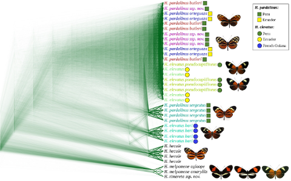
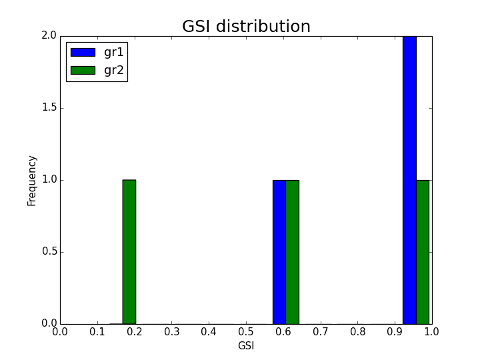

# Genealogical Sorting Index

The script [GSI.py](GSI.py) calculates the genealogical sorting index (GSI) for a given group/groups of trees from the multi-tree newick file. It iterates through all the trees in a file and outputs the GSIs for each tree as well as it summarizes the results with a histogram.

Summarizing the variation in the phylogenetic signal along the genome is problematic due to a large set of trees with different topologies. Often the result of phylogenetic sliding window analysis is visualized with [DensiTree](https://www.cs.auckland.ac.nz/~remco/DensiTree/) :



Such images (the example is taken from [Kryvokhyzha, 2014](http://urn.kb.se/resolve?urn=urn:nbn:se:uu:diva-243477)) allow making only subjective conclusions (e.g. prevailing topology).

However, often researchers are interested in the quantitative evaluation of different phylogenetic hypotheses. The GSI allows such quantitative estimation of the degree of exclusive ancestry of groups of interest.

For more detail on the GSI see: [Cummings et al. 2008](http://onlinelibrary.wiley.com/doi/10.1111/j.1558-5646.2008.00442.x/full)

**Input files example:**

Phylogenetic trees in a multi-newick file (tree.nwk):
```
((((a1,a2),(a3,a4)),((b1,b2),b3)),b4);
(((a1,a2),(a3,a4)),((b1,b2),(b3,b4)));
((((a1,a2),(b3,a4)),a3),((b1,b2),b4));
```

Tree names/coordinates on the genome (tree.names):
```
tree1
tree2
tree3
```

**Output files example:**

GSI for every tree and group (tree.out):
```
TreeName    gr1 gr2
tree1   1.0 0.5625
tree2   1.0 1.0
tree3   0.5625  0.125
```
Distribution of GSI (tree.out.png):



***Note!*** The x-axis is shifted. The bug need to be fixed. Thus, use this plot for exploratory purposes only.

**Command example:**
```
python2 GSI.py -t tree.nwk -o tree.out -g "gr1[a1,a2,a3,a4];gr2[b1,b2,b3,b4]" -c tree.names
```
To see all possible option, run python script with --help option: `python script.py --help`

# To do:
1. Fix the x-axis shift bug.
2. Implement filtering by bootstrap values: (ete2: TreeNode.support)
3. Enable setting root on fly (ete2: TreeNode.set_outgroup)
